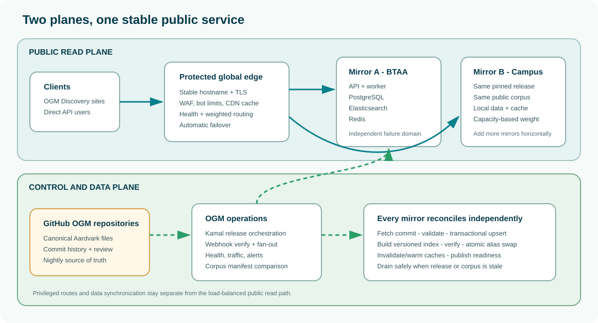
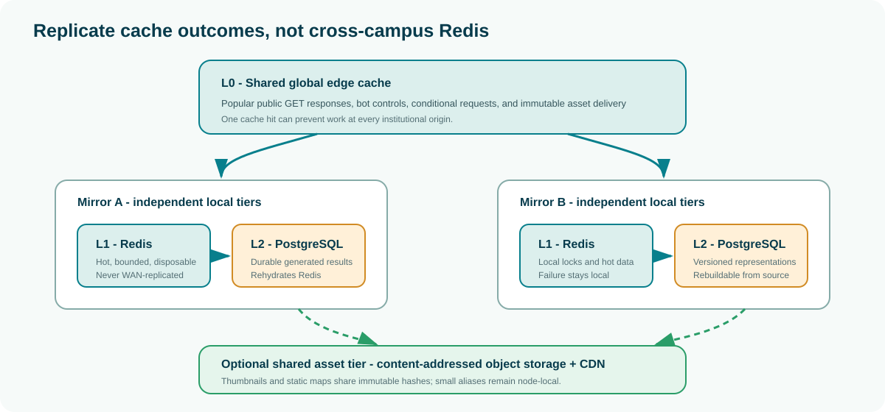

# OpenGeoMetadata API Mirror Network

## Technical Implementation Guide

**Audience:** campus IT staff, geography librarians, OGM service operators, and
technical governance groups<br>
**Status:** proposed pilot architecture<br>
**Companion document:** [Executive summary](opengeometadata-mirror-network-executive-summary.md)

### Contents

1. [Purpose and design principles](#1-purpose-and-design-principles)
2. [Runtime architecture at each institution](#2-runtime-architecture-at-each-institution)
3. [Metadata synchronization and indexing](#3-metadata-synchronization-and-indexing)
4. [Public traffic, failover, and maintenance](#4-public-traffic-failover-and-maintenance)
5. [Cache architecture and cross-institution sharing](#5-cache-architecture-and-cross-institution-sharing)
6. [Network and security requirements](#6-network-and-security-requirements)
7. [Monitoring, recovery, and operating responsibilities](#7-monitoring-recovery-and-operating-responsibilities)
8. [Pilot implementation and acceptance tests](#8-pilot-implementation-and-acceptance-tests)
9. [Implementation decisions to ratify](#9-implementation-decisions-to-ratify)

## 1. Purpose and design principles

The OpenGeoMetadata API Mirror Network turns the existing OGM software and
metadata-sharing practices into a resilient community service. Mirror-host
institutions contribute a modest Linux virtual machine. The OGM service
operator deploys the same versioned API stack to each machine with Kamal. A
protected global endpoint sends public read traffic only to mirrors that are
healthy, compatible, sufficiently current, and within their assigned capacity.

Hardware contribution is intentionally separate from service eligibility.
Service-only adopters can publish Aardvark metadata, configure an institutional
OGM Discovery (`ogm-discovery`) site, and point it to the shared endpoint without
running an OGM API node. This removes the local VM, firewall, patching,
application deployment, monitoring, and backend on-call requirements. At the
architecture layer, a small institution can therefore participate without a
local IT deployment while still adding collections, expertise, and community
reach.

An adopting institution separately customizes OGM Discovery - its theme,
institutional branding, explanatory content, and default search filters - and
publishes the static site through GitHub Pages. The frontend points to one
stable OGM network API hostname, not to the institution's individual mirror.
This keeps the public site available when its local node is drained, upgraded,
reindexed, or temporarily unavailable.

The implementation rests on six principles:

1. **GitHub is authoritative.** Public Aardvark files in OGM repositories are
   the source of truth. Databases, indexes, and caches on every mirror are
   derived and rebuildable.
2. **Mirrors are operationally independent.** Each node has its own PostgreSQL,
   Elasticsearch, Redis, worker, and filesystem. A database or cache failure at
   one institution must not become a network-wide failure.
3. **The public edge is the stable service.** DNS, TLS, web application firewall
   rules, bot controls, response caching, health checks, and weighted routing
   sit in front of the institutional nodes.
4. **Data freshness is measured, not assumed.** A node is ready only when its
   application, search index, corpus manifest, and dependencies pass checks.
5. **Nightly reconciliation is mandatory; webhooks are acceleration.** A missed
   webhook can delay a change, but it cannot permanently cause divergence.
6. **Operations are shared and repeatable.** Mirror hosts maintain the VM and
   campus network. The OGM operator manages the application release, data
   pipeline, traffic pool, and service runbooks. Service-only adopters have no
   backend host responsibility.

### Participation modes and pooled capacity

The network supports three valid relationships:

| Mode | Local infrastructure | Primary contribution | Backend used by the frontend |
| --- | --- | --- | --- |
| Mirror host and adopter | One mirror VM | Capacity, metadata, and a discovery site | Shared network endpoint, including but not pinned to its own node |
| Mirror host only | One mirror VM | Capacity for the whole community | No local frontend required |
| Service-only adopter | None | Metadata, local knowledge, and a discovery site | Shared network endpoint |

The edge treats all eligible mirror capacity as a common pool. It does not
reserve a host's node exclusively for that host's frontend, and it does not
require a frontend's institution to supply an origin. A contributed VM can
therefore serve many small adopters, while those adopters make the shared corpus
and discovery ecosystem more valuable. Capacity sponsors multiply the impact of
their infrastructure; service-only members expand the community without adding
fragile one-off deployments.

This model needs transparent capacity and fair-use policy. The OGM operator
should monitor aggregate demand, assign origin weights from measured headroom,
apply edge quotas that protect the shared service, and publish thresholds for
when the fleet needs another mirror. Admission of a service-only adopter should
be a governance and metadata-readiness decision, not a server-procurement test.

### Scope and non-goals

The mirror network serves the public, read-oriented OGM API. It does not make
privileged administration, deployment, harvest controls, or internal database
ports public through the shared hostname. It also does not create a
cross-campus PostgreSQL cluster, Elasticsearch cluster, or Redis cluster.



The architecture has two deliberately separate paths:

- The **read plane** carries browser and API traffic from OGM Discovery and other
  clients through the protected edge to eligible mirrors.
- The **control and data plane** distributes releases and synchronization work,
  records node state, and never depends on a public request being routed to a
  particular mirror.

## 2. Runtime architecture at each institution

Every mirror runs the same pinned OGM API release and the same service topology.
Kamal deploys the application containers and provides a repeatable upgrade and
rollback path. A typical single-host node contains:

| Component | Responsibility | Persistence |
| --- | --- | --- |
| API/web containers | Public OGM API, request validation, serialization, cache headers, health endpoints | Stateless; replaced on deploy |
| Worker | Repository harvests, record processing, thumbnails, static maps, cache warming, and maintenance jobs | Job state in Redis/PostgreSQL |
| Scheduler | Nightly synchronization, cleanup, health verification, and other periodic work | Configuration only |
| PostgreSQL | Normalized Aardvark records, repository and harvest state, durable response and representation caches | Required local volume and backup |
| Elasticsearch | Versioned search indexes used by public discovery queries | Rebuildable local volume; snapshot optional |
| Redis | Hot response cache, job broker, locks, rate-limit counters, and small aliases | Rebuildable local volume |
| Kamal proxy | Origin TLS termination, container routing, and deploy health checks | Configuration only |

The services communicate on a private Docker network. PostgreSQL, Elasticsearch,
and Redis are not exposed to the public internet. A host can run all components
on one VM because the system is read-heavy and because the fleet supplies
redundancy. If later load tests justify it, the same container roles can be
split across machines without changing the network contract.

### Reference capacity and cost

The current BTAA production design reserves up to 8 CPUs and roughly 5 GB for
the web role, 1.75 CPUs and 2 GB for the worker, a 4 GB Elasticsearch heap, and
a Redis ceiling of 12 GB, plus PostgreSQL, filesystem cache, and the operating
system. The reference mirror specification is therefore:

| Resource | Planning specification |
| --- | --- |
| CPU | 16 vCPU, or 8 current physical cores with simultaneous multithreading |
| Memory | 64 GB RAM; 32 GB is a pilot minimum subject to load testing |
| Storage | 500 GB usable SSD/NVMe with monitoring and at least 20% free-space headroom |
| Network | 1 Gbps interface, stable HTTPS origin path, outbound HTTPS access |
| Operating system | Current Ubuntu LTS or equivalent, Docker, time synchronization, SSH key access |

Use **$1,500 per year per mirror** as an external infrastructure planning
target, not as a procurement quote. **A campus VM from existing capacity may
have little or no incremental cost.** One-time campus effort should be about
4-8 hours for provisioning, firewall/DNS work, access, and contacts. Routine
application work is centralized; local staff continue to own normal VM, OS,
storage, and network support.

For a service-only adopter, the OGM API infrastructure target is **$0 and zero
campus backend hosts**. The institution uses pooled network capacity and takes
on no VM, operating-system, firewall, SSH, container, database, search, or cache
operations. Its implementation work is metadata publication and frontend
customization; optional custom-domain policy may still involve campus IT.

## 3. Metadata synchronization and indexing

### 3.1 Canonical data and provenance

Institutions continue to create, review, and publish OGM Aardvark records in
GitHub. The conventional `metadata-aardvark/` directory identifies the records
to harvest. Repository history provides human-readable change review and a
durable source trail; the mirror database is not a replacement editorial
system.

Every imported record should retain enough provenance to answer four questions:

- Which GitHub organization and repository supplied it?
- Which branch and commit SHA was harvested?
- When did this mirror last observe and validate it?
- Which Aardvark schema/profile and importer version processed it?

Each mirror also builds a **corpus manifest** after synchronization. The
manifest lists every enabled repository, its harvested commit SHA, record
count, validation outcome, and completed time. A deterministic hash of that
manifest becomes the node's `corpus_generation`. This is more reliable than
comparing timestamps because the corpus spans many independently updated
repositories.

### 3.2 Nightly reconciliation

Nightly reconciliation is the correctness mechanism and should run on every
node. Start times should be staggered so the mirrors do not all clone, fetch,
or reindex at once.

1. Acquire a node-local lock so two reconciliations cannot overlap.
2. Refresh the catalog of enabled OGM repositories and verify that each still
   contains `metadata-aardvark/`.
3. Fetch each repository and resolve its configured default branch to a commit
   SHA. A mirror always records exactly which revision it processed.
4. Parse and validate changed Aardvark files. Invalid records are quarantined
   with actionable repository/file/error information; they do not replace the
   last known valid public version silently.
5. Upsert valid records, distributions, and relationships into PostgreSQL in
   bounded transactions. Track each resource as observed in this run.
6. Mark previously imported but unseen resources as missing. Apply the agreed
   deletion policy - normally a grace period followed by a tombstone/removal -
   so a transient checkout problem cannot erase records.
7. Build a new versioned Elasticsearch index from the resulting database.
   Validate mappings, document counts, representative searches, facets, and
   index health before activation.
8. Atomically move the stable Elasticsearch alias from the prior index to the
   new index. Retain at least one previous index for rapid rollback.
9. Publish the new corpus manifest, invalidate generation-dependent caches,
   and warm the small set of high-value endpoints.
10. Mark the node ready only after the API, database, index, corpus freshness,
    and cache dependencies pass. Report success or a repository-specific error
    to the shared dashboard.

The active index continues serving searches while the new version is built.
This means a full nightly reindex does not require a public outage. If a build
or validation fails, the alias remains on the last good index and the node can
continue serving temporarily, subject to the network freshness threshold.

### 3.3 Optional GitHub webhooks

Webhooks reduce the interval between a metadata commit and discovery, but they
do not replace nightly reconciliation. The recommended production pattern is a
single **OGM webhook ingress** rather than registering every repository against
every mirror.

The ingress verifies GitHub's HMAC signature, allows only expected events and
repositories, records the GitHub delivery ID, and acknowledges quickly. It then
coalesces repeated pushes for the same repository and sends an idempotent job
containing the repository name and target commit SHA to every mirror. Each
mirror fetches the commit from GitHub itself; metadata does not transit through
the ingress.

| Webhook pattern | Advantages | Tradeoffs | Recommendation |
| --- | --- | --- | --- |
| Shared ingress with fan-out | One GitHub configuration, central deduplication, visible delivery state, consistent retry policy | Requires a small control-plane service or queue | Production target |
| Direct GitHub webhook to every mirror | Simple for a two- or three-node pilot | Webhook count and secrets grow with repositories x mirrors; harder to audit and retry | Acceptable pilot bridge |
| Scheduled-only | Fewest moving parts | Changes can remain undiscoverable until the next run | Required fallback, not ideal alone |

Webhook work is idempotent. A node records the delivery ID and repository/commit
pair, ignores duplicates, retries transient errors with exponential backoff,
and exposes the last successful commit. Multiple pushes may be collapsed into
one harvest of the newest commit.

After a webhook harvest updates PostgreSQL, a coalesced indexing job makes the
change searchable. Where safe targeted document indexing exists, it may update
only affected records. Otherwise the node runs the same validated,
alias-swapped index build used nightly. The implementation must never report a
new `corpus_generation` until PostgreSQL and the active search index represent
the same accepted corpus.

### 3.4 Consistency and readiness contract

The mirror network is eventually consistent, but the edge should not send
traffic to an unknowably stale node. Every origin should expose a machine-
readable readiness response similar to:

```json
{
  "status": "ready",
  "api_release": "2026.08.2",
  "api_contract": "v1",
  "aardvark_profile": "current",
  "corpus_generation": "sha256:...",
  "last_successful_sync": "2026-08-19T07:18:42Z",
  "repository_count": 87,
  "database_record_count": 412830,
  "search_record_count": 412830,
  "dependencies": {"postgres": "ok", "elasticsearch": "ok", "redis": "ok"}
}
```

The exact fields are part of the network contract and contain no secrets. The
edge or a small health controller admits a node only when:

- its API contract is compatible with the public endpoint;
- its database and search index counts pass configured reconciliation rules;
- its last successful synchronization is within the freshness objective;
- its corpus generation is accepted for the current rollout window;
- required dependencies respond within limits; and
- local capacity checks do not indicate overload or unsafe disk pressure.

During a rolling nightly build, compatible adjacent corpus generations can both
serve. A node outside the maximum lag is automatically drained even if its HTTP
process still returns `200 OK`.

## 4. Public traffic, failover, and maintenance

OGM Discovery, institutional GitHub Pages sites, and direct API clients use one
network hostname. The global edge provides TLS, web application firewall rules,
bot management, request-size limits, rate limits, response caching, and
health-aware origin selection. Public origin addresses are not promoted as
user-facing endpoints.

Only safe public `GET` and `HEAD` routes are placed in the shared pool. Webhook,
admin, reindex, harvest, deployment, and diagnostic routes use a separate
restricted path or management hostname. They require strong authentication and
must not depend on random load-balancer routing.

### Routing behavior

- Assign each mirror a weight based on measured capacity and the institution's
  agreed contribution. Equal participation does not require equal hardware.
- Pool mirror headroom across all adopters. Frontends are not pinned to origins
  at their own institutions, and service-only adopters do not require a local
  origin.
- Track traffic by site/client identifier at the edge so fair-use limits,
  anomaly response, and aggregate capacity forecasts remain transparent without
  treating the identifier as a browser secret.
- Route only to nodes passing readiness. Simple process uptime is insufficient.
- Avoid session affinity for public reads. Any compatible node should answer the
  same request from the same accepted corpus.
- Apply per-client and aggregate limits at the edge, with a local node-level
  backstop. Edge limits prevent abusive traffic from consuming campus links.
- Retry only idempotent requests and only when no response body has been sent.
  A retry budget prevents one request from cascading across every origin.
- Use circuit breakers so a slow node is temporarily removed before queues and
  timeouts spread through the fleet.

### Planned maintenance and application upgrades

The mirror network creates a maintenance window for every institution:

1. Set the node's traffic weight to zero and confirm that active connections
   have drained.
2. Take an application and dependency snapshot appropriate to the change.
3. Deploy the pinned container release with Kamal. Database migrations must be
   backward-compatible with the version still running on other mirrors.
4. Run migrations, local smoke tests, synchronization, any required atomic
   reindex, and cache warming.
5. Verify API contract, corpus freshness, representative query checksums,
   latency, disk headroom, and error rate.
6. Restore a small traffic weight, observe the canary, then ramp to the node's
   normal share. Roll back while it remains drained if checks fail.

The public API URL and institution's OGM Discovery site do not change during this
process. The same drain workflow applies to campus OS patching. Network-level
failover handles an unexpected host or campus outage by removing the failed
origin and using the remaining healthy mirrors.

## 5. Cache architecture and cross-institution sharing

### Can caches be replicated across institutions?

**Yes, but the network should share cache results rather than form a
cross-campus Redis cluster.** Redis replication and clustering assume a
low-latency, tightly controlled network. Stretching them across campuses would
couple failures, create difficult partition and security behavior, and make a
cache outage capable of affecting the entire federation.

Use a layered model instead:



| Layer | Location | Stores | Replication approach |
| --- | --- | --- | --- |
| L0: edge cache | Global edge/CDN | Cacheable public `GET` responses and immutable assets | Provider replicates content geographically; all mirrors benefit |
| L1: hot cache | Redis on each mirror | Search/facet responses, resource representations, aliases, locks, rate counters | Never replicated across campuses; rebuilt locally |
| L2: durable generated cache | PostgreSQL on each mirror | API responses, generated record representations, and visual assets that are expensive to regenerate | Rehydrates local Redis; rebuildable or backed up locally |
| Optional shared asset tier | S3/R2-compatible object storage behind CDN | Content-addressed thumbnails, static maps, and other immutable generated files | Shared by object key, not by database or Redis replication |

This design preserves independent failure domains while avoiding repeated work.
A popular query is answered from the edge before it reaches any campus. An
expensive thumbnail generated by one node can later be stored under a content
hash in shared object storage and reused by every node. A restarted Redis can
rehydrate important entries from that node's durable PostgreSQL cache.

### Cache keys and coherence

Cache correctness depends on versioned, deterministic keys. Keys should include
the API contract, cache schema version, normalized route/query parameters, and
the accepted corpus generation when the response depends on corpus-wide state.
Generated assets should use a content or source hash so identical work produces
the same immutable key at every institution.

Use these invalidation rules:

- A changed record invalidates tags such as `resource:<id>` on the node that
  harvested it, including detail responses, representations, relationships,
  and aliases.
- A completed full reindex advances the corpus/cache generation and invalidates
  search, suggestion, facet, map-aggregation, and sitemap namespaces.
- A deploy that changes serialization or generation logic advances an explicit
  cache version. Old entries expire naturally and cannot be read under the new
  namespace.
- The edge uses short TTLs or surrogate-key purges for mutable search responses.
  It uses very long TTLs plus `immutable` for content-hashed visual assets.
- `ETag` and conditional requests reduce transfer when an object has not
  changed. `stale-while-revalidate` and `stale-if-error` preserve service during
  brief origin or upstream trouble where the content policy permits.

Suggested starting policies, to be tuned from pilot measurements:

| Response class | Edge policy | Mirror policy |
| --- | --- | --- |
| Search, suggest, and facets | 1-5 minute TTL; brief stale-while-revalidate | Redis 5-30 minutes; durable copy where valuable |
| Resource detail | 10-15 minute TTL; purge by resource tag when available | Versioned Redis plus durable PostgreSQL representation |
| Content-hashed thumbnail/static map | 1 year, `immutable` | Durable asset plus bounded Redis hot copy |
| OpenAPI/schema/configuration | 1 hour, purged on release | Local memory/Redis as appropriate |
| Readiness, admin, personalized, or privileged response | No shared caching | No cache or explicitly private cache |
| Errors | Do not cache `5xx`; use only a very short negative cache for stable `404` results | Same principle |

Cache keys must account for every response-changing header or parameter.
Responses that vary by authorization, institution, language, or content type
must either include that dimension in the key and `Vary` headers or bypass the
shared edge. Static frontend credentials are visible to browsers; they are
identifiers with narrow quotas, never secrets.

### Warming without filling Redis with the world

After a deploy or reindex, warm a bounded list: health and configuration,
homepage/default searches, facets, common map aggregations, featured resources,
and recently popular records. Durable visual assets and aliases can be prepared
in batch, but the full image corpus should not be loaded into Redis. Redis is
for the hot working set; PostgreSQL/object storage is the durable tier.

Use distributed locks local to each node, request coalescing, TTL jitter, and
background refresh to avoid cache stampedes. Upstream image providers should
have concurrency limits, timeouts, cooldowns, and failure backoff so a cold
cache does not become an accidental denial-of-service against another library.

## 6. Network and security requirements

The minimum campus network contract is intentionally small:

| Direction | Access | Notes |
| --- | --- | --- |
| Inbound | HTTPS from the approved global-edge address ranges | Prefer origin firewall allowlisting; no direct public database/cache access |
| Inbound management | SSH from named campus/OGM operator networks or VPN | Key-based access, least privilege, audited changes |
| Outbound | HTTPS to GitHub, container registry, monitoring, and optional object/backup storage | DNS and time synchronization also required |
| Internal only | PostgreSQL, Elasticsearch, Redis, worker monitoring | Bind to private host/container networks |

Secrets live in the deployment secret store and are injected at runtime. They
are not committed to OGM metadata repositories, the application repository, or
an OGM Discovery theme. GitHub webhook requests require `X-Hub-Signature-256`
verification, replay/delivery-ID handling, event allowlisting, and body-size
limits before any job is enqueued.

The container image should be pinned to an immutable release or digest and
scanned in the common build pipeline. Campus IT patches the host OS and Docker;
the OGM operator patches and deploys application containers. All components
follow an agreed support window so a security release can be staged quickly
without forcing every campus into the same maintenance hour.

Logs should be structured and centralized enough for incident response, but
must not retain unnecessary patron identifiers or complete sensitive query
strings. Public error bodies return stable, generic messages rather than stack
traces, SQL, search internals, filesystem paths, or credentials.

## 7. Monitoring, recovery, and operating responsibilities

### Shared observability

The network dashboard should expose both technical health and metadata health:

- origin availability, request rate, latency percentiles, error rate, active
  connections, and traffic weight;
- CPU, memory, disk use and growth, inode use, container restarts, Redis
  evictions, database connection pressure, and Elasticsearch cluster/index
  state;
- API release and contract, corpus generation, last successful nightly run,
  last webhook delivery, repository/record counts, invalid records, missing
  records, and database-to-index count variance;
- cache hit ratios at the edge and at each mirror, asset-generation failures,
  upstream provider cooldowns, and background queue age;
- a small set of synthetic searches run through the global endpoint and
  directly against every origin, with normalized response checksums to detect
  silent divergence.

Alerts should be actionable. A librarian needs the repository and file causing
a validation failure. Campus IT needs disk, host, or network evidence. The OGM
operator needs the failing release, dependency, job, or corpus generation.

### Backup and rebuild

GitHub Aardvark repositories are the canonical metadata backup. A mirror can be
rebuilt by provisioning a host, deploying the pinned release, harvesting the
repositories, rebuilding the search alias, warming caches, and passing
readiness. This should be tested, not merely documented.

Back up the smaller state that is not conveniently reproduced: deployment
configuration and secret recovery material, the repository catalog and harvest
audit state, user-submitted feedback or analytics if retained, and any generated
assets not stored in shared object storage. PostgreSQL backups and Elasticsearch
snapshots shorten recovery time but do not become the authoritative metadata
source. Backup credentials and copies must be outside the failed host.

A restoring node remains out of the traffic pool until its corpus, search index,
and release pass the same readiness checks as a new node.

### Responsibility matrix

| Activity | Geography librarians | Campus IT | OGM service operator | OGM governance |
| --- | --- | --- | --- | --- |
| Aardvark creation, review, and repository quality | Responsible | Informed | Supports tooling | Sets shared profile/policy |
| OGM Discovery branding, content, and default filters | Responsible | Supports domain/Pages policy | Provides releases and examples | Sets accessibility baseline |
| Service-only adopter onboarding | Responsible for metadata and site configuration | Not required for backend; supports optional domain policy | Provides shared endpoint, onboarding, quotas, and operations | Sets eligibility and fair-use policy |
| VM, OS, storage, firewall, DNS, and SSH | Informed | Responsible | Consulted/operator access | Defines minimum host contract |
| Kamal deploys, application secrets, workers, indexes, and caches | Informed | Consulted | Responsible | Approves release policy |
| Edge routing, WAF, bot controls, health, and drain/rejoin | Informed | Consulted | Responsible | Approves service objectives |
| Metadata freshness and validation response | Responsible for source fixes | Informed | Responsible for pipeline | Resolves policy exceptions |
| Security incident coordination | Consulted | Responsible for host/network | Responsible for app/service | Accountable for the operating compact |

The intended boundary is: **mirror hosts supply machines; the OGM network
operates the application; librarians steward metadata and the discovery
experience; service-only adopters participate without backend infrastructure.**

## 8. Pilot implementation and acceptance tests

A 90-day pilot should use the current BTAA node plus two mirror-host
institutions and at least one service-only adopter. Implement in this order:

1. Ratify the API/readiness contract, supported release policy, corpus manifest,
   responsibility matrix, security baseline, and pilot service objectives.
2. Provision the shared edge, origin certificates, WAF/rate-limit policy,
   monitoring, and a staging hostname.
3. Provision two campus VMs from the reference profile. Confirm disk and network
   performance, firewall paths, SSH access, backups, and contacts.
4. Deploy the same pinned OGM API release with Kamal. Perform the first full
   harvest, atomic index build, and bounded cache warm before adding traffic.
5. Point pilot OGM Discovery builds to the shared staging API. Complete local
   branding, content, accessibility review, and institutional default filters.
   Include a service-only institution with no campus VM or backend deployment.
6. Exercise routine sync, webhook acceleration, a failed webhook, invalid
   metadata, record removal, stale-node drain, and index rollback.
7. Load test legitimate traffic and controlled bot-like traffic. Confirm the
   edge absorbs/rate-limits it and that adding a mirror increases measured
   aggregate capacity.
8. Drain each node in turn for a Kamal and OS maintenance rehearsal. Rebuild one
   node from documented backups and GitHub source.
9. Publish the measured onboarding time, operating effort, cost, cache hit
   ratios, freshness, failover behavior, and remaining risks.

Recommended pilot acceptance criteria are:

- all mirrors pass the same API contract and representative response tests;
- nightly synchronization completes and the dashboard proves corpus/index
  agreement; webhook-triggered changes meet the pilot freshness target;
- loss or planned drain of any one node causes no public URL change and no
  manual client action;
- a stale, incompatible, overloaded, or low-disk node is removed automatically;
- a release can be canaried, rolled back, and later completed across the fleet;
- edge plus node-local cache hit ratios materially reduce origin and upstream
  work; shared immutable assets are evaluated with measured costs;
- the VM and ongoing campus support burden remain within the planning target;
- a service-only adopter launches against pooled capacity without provisioning
  a backend host or requiring campus application operations;
  and
- a geography librarian can trace a rejected or stale record back to the exact
  repository/file and understand the required correction.

Initial pilot objectives should be treated as measurements rather than promises:
webhook changes discoverable within 15 minutes when the pipeline is healthy,
nightly reconciliation completing within its maintenance window, a maximum
24-hour freshness threshold for traffic eligibility, and automatic origin
removal within approximately one minute of a failed readiness check. Production
service levels should be adopted only after the pilot establishes real load,
failure, and staffing data.

## 9. Implementation decisions to ratify

The pilot group can begin once it makes these bounded decisions:

1. Select the global edge provider and decide who owns its account, billing,
   DNS, certificates, WAF policy, and emergency access.
2. Define the public API contract and which routes are cacheable and
   load-balanced.
3. Adopt the corpus manifest, freshness threshold, validation/deletion policy,
   and node readiness schema.
4. Choose the pilot webhook pattern and the long-term shared fan-out mechanism.
5. Decide whether shared content-addressed object storage is in the initial
   pilot or a measured second phase.
6. Ratify host/app security ownership, incident contacts, maintenance notice,
   release cadence, and rollback authority.
7. Approve a small set of user-facing and operational service objectives to
   measure during the pilot.
8. Ratify service-only admission, fair-use limits, capacity reporting, and the
   threshold for requesting additional mirror sponsors.

None of these decisions requires a new institutional software project. For a
service-only adopter, none requires local backend infrastructure at all. They
turn the existing OGM schema, GitHub repositories, OGM API, Kamal deployment,
and customizable OGM Discovery frontend into a governed, observable, and
rehearsable shared service that institutions can strengthen with capacity,
metadata, or both.

## Technical foundations

- [OpenGeoMetadata](https://opengeometadata.org/)
- [OpenGeoMetadata repositories](https://github.com/OpenGeoMetadata)
- [BTAA Geospatial API](https://github.com/geobtaa/api)
- [OGM API](https://github.com/ewlarson/ogm-api)
- [OGM Discovery (`ogm-discovery`)](https://github.com/ewlarson/ogm-discovery)
- [BTAA API architecture and cache model](https://github.com/geobtaa/api/blob/develop/docs/README.md)
- [BTAA atomic reindex and maintenance tasks](https://github.com/geobtaa/api/blob/develop/docs/make_tasks.md)
- [BTAA OGM harvesting design](https://github.com/geobtaa/api/blob/develop/docs/backend/ogm_harvesting.md)
- [BTAA production Kamal configuration](https://github.com/geobtaa/api/blob/develop/config/deploy.prd.yml)
- [Kamal](https://kamal-deploy.org/)
- [GitHub webhook validation](https://docs.github.com/en/webhooks/using-webhooks/validating-webhook-deliveries)
