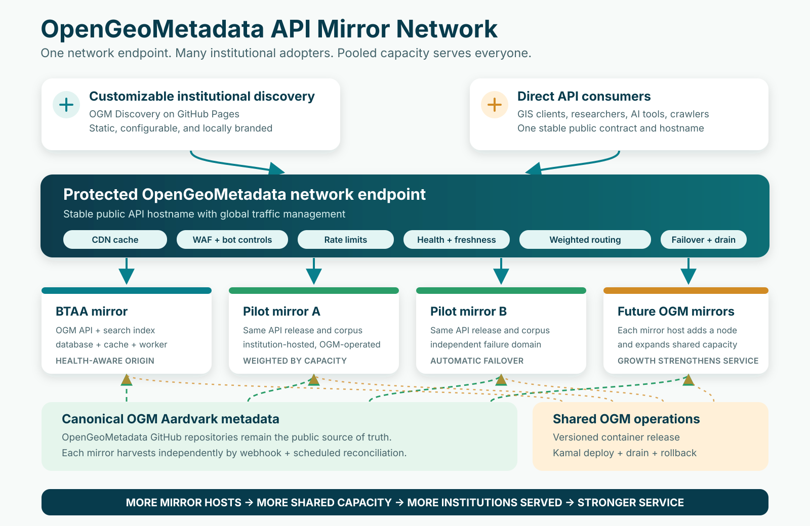

# OpenGeoMetadata API Mirror Network

## Shared infrastructure that becomes stronger with every new member

### Executive summary

**Companion document:** [Technical Implementation Guide](opengeometadata-api-mirror-network-technical-implementation.md)

OpenGeoMetadata has already solved the hardest community problems: a shared
discovery schema in OGM Aardvark, a distributed and transparent way to steward
metadata in GitHub, a proven API platform for harvesting and serving those
records, and a configurable `abcdefgeo` frontend that can be branded for an
institution and hosted as a static site on GitHub Pages.

The next step is to make delivery as collaborative as the metadata.

The OpenGeoMetadata API Mirror Network would place a protected, health-aware global
endpoint in front of multiple institutional deployments of the OGM API. A
participating institution would contribute one ordinary Linux virtual machine
and a technical contact. The OGM service operator would deploy and maintain the
containerized API stack with Kamal, keep the mirror synchronized with the public
OGM Aardvark repositories, monitor its readiness, and add it to the shared
traffic pool.

Every `abcdefgeo` site would use the same stable network API endpoint. Its theme
would present the adopting institution's brand and, when desired, scope search
results to that institution by default. The underlying API would still expose
the shared OGM corpus, enabling broader discovery and reuse.

This produces an unusually favorable exchange:

> An institution contributes the equivalent of one modest server and gains the
> foundation for a customizable, institution-branded geospatial discovery
> platform backed by the combined capacity and resilience of the
> OpenGeoMetadata community.

Growth no longer concentrates traffic and risk on one campus. Each new adopter
also becomes a capacity contributor. The network becomes harder to overwhelm,
less dependent on any single institution, and more useful to every member as it
grows. It also gives every institution a safe maintenance window: a local
mirror can be drained for operating-system or application upgrades while the
institution's discovery site continues using the remaining network.

## The proposal

Create a shared public read endpoint for OGM services, backed by a federation of
compatible API mirrors hosted by participating institutions.

1. **OpenGeoMetadata repositories remain the canonical source.** Institutions
   continue publishing public Aardvark records through the existing GitHub
   model. No institution gives up ownership or control of its metadata.
2. **Each mirror serves the full public corpus.** A mirror independently
   harvests and indexes the same OGM repositories using webhook events and
   scheduled reconciliation. The nodes do not need cross-campus database
   replication.
3. **A protected global edge manages public traffic.** A stable hostname applies
   caching where appropriate, rate limits and bot controls, checks each origin's
   health and data freshness, and routes requests by capacity and availability.
   A node can be taken out of rotation for planned maintenance without changing
   the public URL.
4. **`abcdefgeo` provides the institutional experience.** The static frontend
   runs on GitHub Pages, carries local branding and content in configuration,
   and queries the shared network endpoint. The frontend requires no local
   application server.
5. **Kamal makes operations repeatable.** The OGM operator deploys the same
   versioned container release to every mirror, stages upgrades, checks
   compatibility, and can roll back quickly.

The public edge should load balance only the read-oriented API surface. Admin,
harvest, deployment, and other privileged operations remain off the shared
public route. An origin is eligible for traffic only when its application
version, search services, record freshness, and capacity checks pass.

## Why directors should support it

### One contribution produces five returns

- **A public service without a local software project.** The institution gains a
  production-grade discovery backend and the foundation for a customizable,
  institution-branded frontend without assembling its own development team.
- **Protection against traffic spikes and abusive automation.** Edge controls
  absorb or reject unwanted traffic before it reaches campus systems, while
  healthy origins share legitimate requests.
- **Continuity through institutional outages.** Maintenance, network incidents,
  or a failed mirror do not require users to change URLs. Traffic moves to the
  remaining healthy nodes. Local teams gain time to patch, upgrade, test, and
  return their node to service without creating a public outage.
- **Shared improvements without repeated procurement.** New API capabilities,
  accessibility work, performance improvements, and frontend features can move
  through one common release path.
- **Visible participation in community infrastructure.** A member does not
  merely consume a shared service; it contributes durable capacity that benefits
  researchers and libraries across the network.

### The scaling model is the strategic advantage

A centralized service becomes more expensive and more fragile as adoption
grows. The mirror network reverses that relationship:

**new institution -> branded discovery site + mirror node -> more shared
capacity -> stronger service for every member -> easier next adoption**

The result is cooperative infrastructure with horizontal capacity, geographic
diversity, and organizational redundancy. No single library has to provision
for the whole community's peak traffic, and no single campus becomes the
permanent point of failure.

## What each institution contributes and gains

| Participating institution provides | OGM service operator provides | Institution and community gain |
| --- | --- | --- |
| One production Linux VM | Kamal-based installation and upgrades | Foundation for a customizable, institution-branded `abcdefgeo` site |
| Public HTTPS connectivity from the network edge | API, database, search, cache, and worker configuration | Shared full-corpus OGM API |
| Firewall, DNS, SSH, and OS coordination | Metadata harvesting and indexing | Automatic failover and maintenance windows |
| A named technical and service contact | Health monitoring, traffic weights, rollback, and runbooks | Edge bot controls and rate limiting |
| Normal campus VM and network support | Compatibility testing and incident coordination | A voice in shared product governance |

The intended division is simple: **the institution hosts the machine; the OGM
network operates the application.**

## Cost and effort

### Reference mirror profile

The current BTAA production deployment is already a single-host Kamal design.
Its published production resource envelope reserves up to 8 CPUs and about 5 GB
for the web role, 1.75 CPUs and 2 GB for the worker, a 4 GB Elasticsearch heap,
and a Redis ceiling of 12 GB, in addition to PostgreSQL, Docker, filesystem
cache, and the operating system.

A conservative reference mirror therefore is:

| Resource | Planning specification |
| --- | --- |
| CPU | 16 vCPU, or 8 modern physical cores with simultaneous multithreading |
| Memory | 64 GB RAM; 32 GB is a pilot minimum subject to load testing |
| Storage | 500 GB usable SSD/NVMe, preferably protected by campus storage or disk redundancy |
| Network | 1 Gbps interface, stable public HTTPS path, normal outbound access to GitHub and the container registry |
| Operating system | Current Ubuntu LTS or equivalent, Docker, SSH key access |

This is deliberately ordinary infrastructure. As an August 2026 external price
benchmark, a Hetzner AX42-class dedicated server provides 8 physical cores / 16
threads, 64 GB RAM, two 512 GB NVMe drives, and a 1 Gbps connection for about
$117 per month before IPv4, tax, and setup. That is approximately **$1,405 per
year**. Limited inventory can be lower.

**A campus VM from existing capacity may have little or no incremental cost.**

For budgeting, use **$1,500 per year per mirror node** as the target
infrastructure contribution, with local chargeback replacing the external
benchmark when applicable. This is not a procurement quote. A mainstream
public-cloud VM can cost materially more; the design does not require one.

The global edge, DNS, and shared monitoring are network-level costs rather than
per-institution costs. At pilot scale they should be budgeted centrally and are
expected to be small compared with even one local software implementation.

### Target institutional effort

- **One time:** 4-8 staff hours to provision the VM, establish DNS/firewall
  rules, confirm SSH access, and name contacts.
- **Ongoing:** at most a few host-support hours per quarter for OS maintenance,
  capacity changes, and campus networking. Application releases and routine
  data operations are handled centrally.
- **No local frontend server:** `abcdefgeo` builds and publishes through GitHub
  Pages.

These are pilot targets to validate, not contractual service levels.

## Operating safeguards

The network should launch with a short operating compact:

- **Version discipline:** mirrors run a supported, pinned OGM API release.
  Upgrades are staged, canaried, and reversible.
- **Maintenance without service interruption:** an institution can drain its
  mirror, complete OS or OGM API work on its own schedule, and rejoin only after
  readiness and freshness checks pass. Its public discovery site continues
  through other healthy mirrors.
- **Readiness, not simple uptime:** the edge checks API compatibility, search
  health, data freshness, and capacity before admitting a mirror to rotation.
- **Weighted participation:** traffic weights reflect each institution's stated
  capacity; a smaller node is still valuable and is not overloaded for the sake
  of even distribution.
- **Origin protection:** mirror addresses are not advertised as the primary
  public service. Firewalls should accept application traffic from the edge and
  restrict administrative access.
- **Rebuildable nodes:** GitHub Aardvark repositories remain canonical. Search
  indexes, caches, and public read databases are derived state that can be
  rebuilt, reducing backup complexity and vendor lock-in.
- **Transparent status:** members can see mirror health, software version,
  corpus freshness, and current traffic weight.
- **Clear responsibility:** OGM owns application operations and routing;
  institutions own VM, OS, and campus network availability; the community owns
  schema and service policy.

## Recommended pilot

Authorize a 90-day, three-node pilot using the current BTAA node plus two
adopting institutions such as UT Austin and the University of Nevada, Reno.

The pilot should prove five things:

1. A new institution can be provisioned with no local application development.
2. All mirrors serve a compatible API and sufficiently fresh corpus.
3. Loss of one node - or a planned node drain for an upgrade - causes no
   user-visible URL change and no manual intervention.
4. Bot controls and rate limits protect origins while legitimate traffic is
   distributed by health and capacity.
5. Aggregate tested capacity increases when a mirror joins the pool, while the
   measured institutional support burden remains within the target.

At the end of the pilot, publish the measured onboarding time, operating effort,
cost, traffic distribution, failover result, and metadata freshness. Those
results become the evidence and onboarding package for the next institution.

## Decision requested

Approve the OpenGeoMetadata API Mirror Network as a shared-infrastructure pilot;
authorize a three-node implementation; designate one service sponsor and one
technical contact at each participating institution; and charge the OGM working
group with returning a production governance and service-level proposal based
on measured results.

The community has already created the schema, the metadata network, the API,
and the low-maintenance frontend. The mirror network is the piece that turns
those assets into durable, community-scale infrastructure.

## Foundations and planning sources

- [OpenGeoMetadata](https://opengeometadata.org/)
- [OpenGeoMetadata repositories on GitHub](https://github.com/opengeometadata)
- [BTAA Geospatial API](https://github.com/geobtaa/api)
- [OpenGeoMetadata API](https://github.com/ewlarson/ogm-api)
- [`abcdefgeo`](https://github.com/ewlarson/abcdefgeo)
- [BTAA production Kamal configuration](https://github.com/geobtaa/api/blob/develop/config/deploy.prd.yml)
- [Hetzner AX42 hardware and June 2026 pricing](https://docs.hetzner.com/general/infrastructure-and-availability/price-adjustment/)
- [Cloudflare load balancing and health-aware routing](https://developers.cloudflare.com/load-balancing/)
